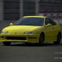

# ZeroDIM - Official PyTorch Implementation
> [An Image is Worth More Than a Thousand Words: Towards Disentanglement in the Wild](http://www.vision.huji.ac.il/zerodim)  
> Aviv Gabbay, Niv Cohen and Yedid Hoshen  
> Neural Information Processing Systems (NeurIPS), 2021.

> **Abstract:** Unsupervised disentanglement has been shown to be theoretically impossible without inductive biases on the models and the data. As an alternative approach, recent methods rely on limited supervision to disentangle the factors of variation and allow their identifiability. While annotating the true generative factors is only required for a limited number of observations, we argue that it is infeasible to enumerate all the factors of variation that describe a real-world image distribution. To this end, we propose a method for disentangling a set of factors which are only partially labeled, as well as separating the complementary set of residual factors that are never explicitly specified. Our success in this challenging setting, demonstrated on synthetic benchmarks, gives rise to leveraging off-the-shelf image descriptors to partially annotate a subset of attributes in real image domains (e.g. of human faces) with minimal manual effort. Specifically, we use a recent language-image embedding model (CLIP) to annotate a set of attributes of interest in a zero-shot manner and demonstrate state-of-the-art disentangled image manipulation results.

<a href="https://arxiv.org/abs/2106.15610" target="_blank"></a> <a href="https://replicate.ai/avivga/zerodim" target="_blank"></a>

## Results

### Human Face Manipulation (FFHQ)

| Input | Kid | Asian | Gender | Red Hair |
|:---:|:---:|:---:|:---:|:---:|
||||||
||||||
||||||
||||||
||||||

### Animal Species Translation (AFHQ)

| Input | Labradoodle | Husky | Chihuahua | Jaguar | Bombay Cat |
|:---:|:---:|:---:|:---:|:---:|:---:|
|||||||
|||||||
|||||||
|||||||
|||||||

### Car Type and Color Manipulation (Stanford Cars)
| Input | Jeep | Sports | Family | White | Red |
|:---:|:---:|:---:|:---:|:---:|:---:|
|||||||
|||||||
|||||||
|||||||
|||||||


## Requirements


This repository imports modules from the StyleGAN2 architecture (**not pretrained**).
Clone the following repository:
```
git clone https://github.com/rosinality/stylegan2-pytorch
```
Add the local StyleGAN2 project to PYTHONPATH. For bash users:
```
export PYTHONPATH=<path-to-stylegan2-project>
```

## Training
In order to train a model from scratch, do the following preprocessing and training steps.
First, create a directory (can be specified by `--base-dir` or set to current working directory by default) for the training artifacts (preprocessed data, models, training logs, etc).

### Synthetic Benchmarks
For each of the synthetic benchmarks (Shapes3d, Cars3d, dSprites, SmallNorb), download the dataset from the original source to a new local directory (e.g. `shapes3d-dataset`) and apply the following preprocessing:
```
python main.py preprocess --dataset-id shapes3d --dataset-path shapes3d-dataset --out-data-name shapes3d-x64
```
As an alternative, we provide the preprocessed datasets for the synthetic benchmarks evaluated in the paper. You can download the files directly and place them under `<base-dir>/cache/preprocess`: [Shapes3d](https://drive.google.com/file/d/1DCtk9v8U9Dlxzb7lOqYNTRoDkQzZxLrT/view?usp=sharing), [Cars3d](https://drive.google.com/file/d/1ZOcs2Kzt1R3vZVaeemMkXZAuIMrDq-hO/view?usp=sharing), [dSprites](https://drive.google.com/file/d/1TswTN9-nOMXS0ZkrZFxWOg56q3TXLDig/view?usp=sharing), [SmallNorb](https://drive.google.com/file/d/1FzLBSBMPyCc2xV2snXc1WuzM6GOgfDwb/view?usp=sharing).

The models can then be trained as follows:
```
python main.py train --config shapes3d --data-name shapes3d-x64 --model-name zerodim-shapes3d-x64
```

Evaluation of DCI, SAP and MIG is stored under `<base-dir>/eval/<data-name>/<model-name>`.

### Zero-shot Disentangled Image Manipulation
For training a model on real images, without any manual annotations, first prepare an unlabeled image dataset. E.g. for FFHQ, download the [FFHQ dataset](https://github.com/NVlabs/ffhq-dataset), create a local directory named `ffhq-dataset` with all the png images placed in a single `imgs` subdir, and apply the following preprocessing:
```
python main.py preprocess --dataset-id ffhq --dataset-path ffhq-dataset --out-data-name ffhq-x256
```

The images are then annotated in a zero-shot manner using [CLIP](https://github.com/openai/CLIP). Clone the external repository and add to your local path:
```
git clone https://github.com/openai/CLIP
export PYTHONPATH=<path-to-clip-project>
```

For example, human face images can be annotated as follows:
```
python annotate_with_clip.py --data-name ffhq-x256 --K 1000
```

The model can then be trained as follows:
```
python main.py train --config ffhq_clip --data-name ffhq-x256 --model-name zerodim-ffhq-x256
```

#### Resources
The training automatically detects all the available gpus and applies multi-gpu mode if available.

#### Logs
During training, loss metrics and translation visualizations are logged with tensorboard and can be viewed by:
```
tensorboard --logdir <base-dir>/cache/tensorboard --load_fast true
```

## Pretrained Models
We provide a model pretrained on human face images ([FFHQ](https://github.com/NVlabs/ffhq-dataset)), with partial annotations obtained in a zero-shot manner using [CLIP](https://github.com/openai/CLIP) for the following attributes: `age, gender, ethnicity, hair_color, beard, glasses`. Download the entire model directory from [zerodim-ffhq-x256](https://drive.google.com/drive/folders/1RXqLyo43uhRx5laTlEHQtnpZssotPPQK?usp=sharing) and place it under `<base-dir>/cache/models`.

## Inference
Given a trained model (either pretrained or trained from scratch), a test image can be manipulated as follows:
```
python main.py manipulate --model-name zerodim-ffhq-x256 --factor-name gender --img face.png --output face_in_all_genders.png
```

**Note:** Face manipulation models are very sensitive to the face alignment. The target face should be aligned exactly as done in the pipeline which CelebA-HQ and FFHQ were created by. Use the alignment method implemented [here](https://github.com/Puzer/stylegan-encoder/blob/master/align_images.py) before applying any of the human face manipulation models on external images.

## Citation
```
@inproceedings{gabbay2021zerodim,
  author    = {Aviv Gabbay and Niv Cohen and Yedid Hoshen},
  title     = {An Image is Worth More Than a Thousand Words: Towards Disentanglement in the Wild},
  booktitle = {Neural Information Processing Systems (NeurIPS)},
  year      = {2021}
}
```
